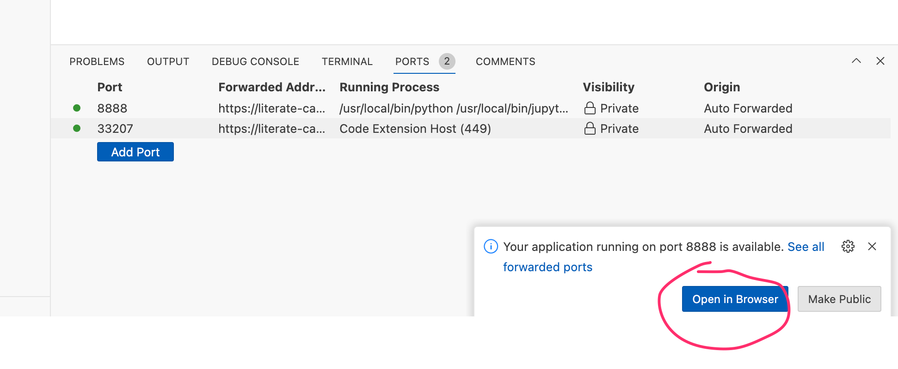

# ou-m269-devcontainer-demo

Unofficial minimal dev container demo for M269.

Access the Python environment provided by the online VCE Dokcer container within a browser based VS Code IDE using GitHub Codespaces and simple `.devcontainer` script.

Wait for the container to be built:

I have my GitHub Codespace environment configured to attempt to launch into JupyterLab and need to manually open the container into a VS Code environment. *Using GitHub default settings, the container would ordinarily open into a VS Code environment automatically.*

Any notebooks uploaded to the environment can be viewed and executed in VS Code. However, it is also possible to run the classic notebook environment from Codespaces too.

## Using the VS Code Environment

The VS Code environment is preinstalled with a Git extension.

If you launch the devcontainer powered Codespace from your own repository you can commit updates back to the repository you started the container from. Updates will also persist inside the container.

## Initialising the environment and Using the Classic Notebook Environment

To initialise the environment and to access start classic notebook server, the container runs the `start.sh` command in the background when the container is started (see the `.devcontainer/decontainer.json` `"postStartCommand"` setting).

*Note that if we do not autorun this command, we can manually issue the `start.sh` command from the VS Code terminal.*

The `.devcontainer` script also exposes port 8888, the default port on which the Jupyter notebook server runs. Select the `ports` tab in VS Code then hover over `8888` port entry to raise a pop-up menu that provides a "globe" link that lets you click to open that location in your web browser.

If we manually run the `start.sh` command, the notebook server port should be forwarded automatically:

Use the password `M269 23J` to access the classic notebook server UI:

You can check the password by running the command `jupyter server list` in a new terminal:

