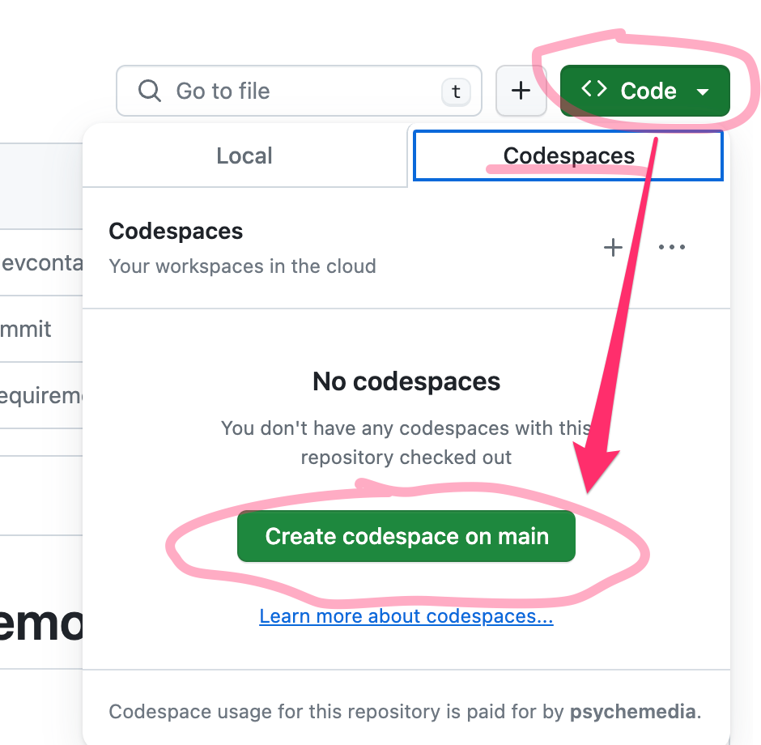
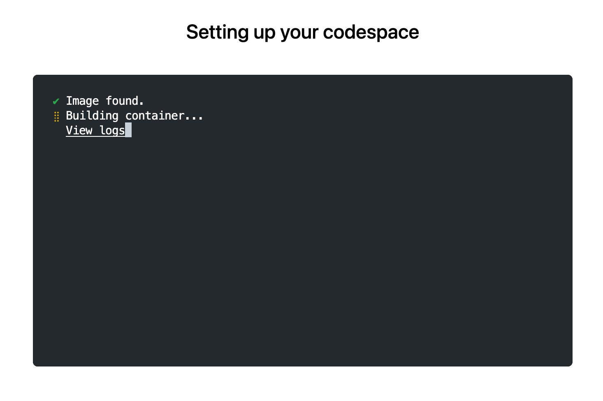
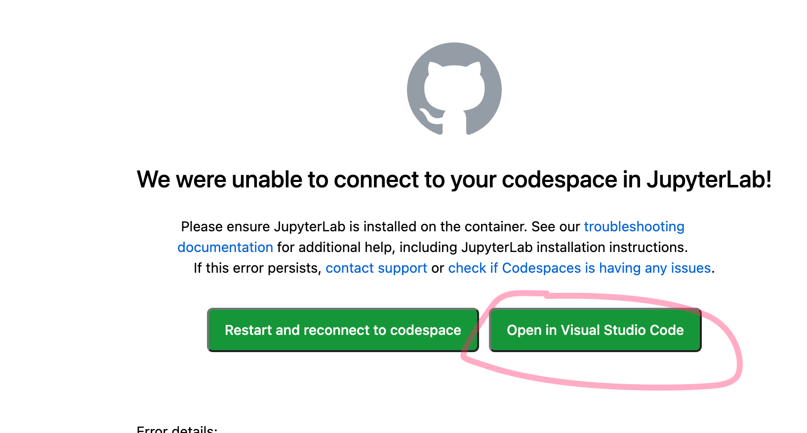
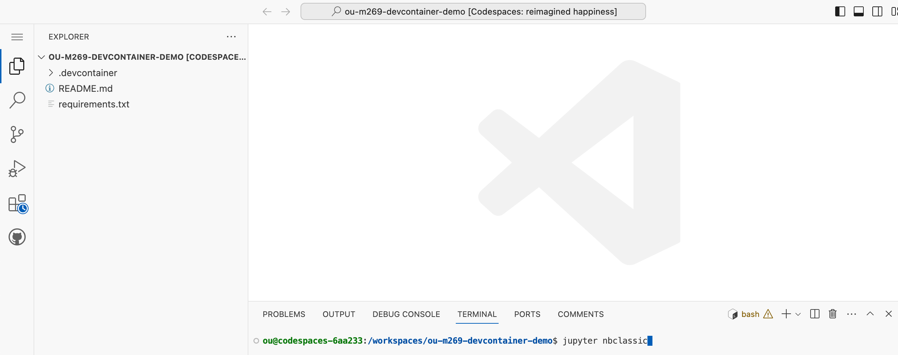
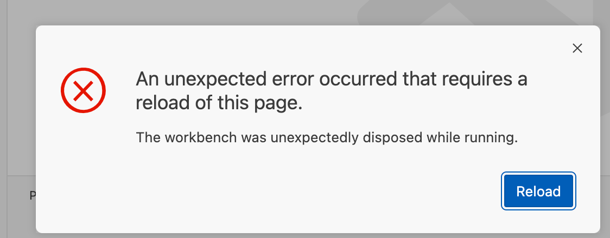
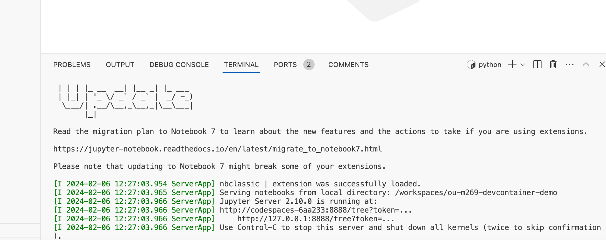
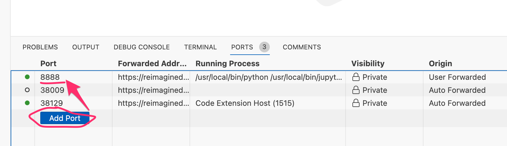
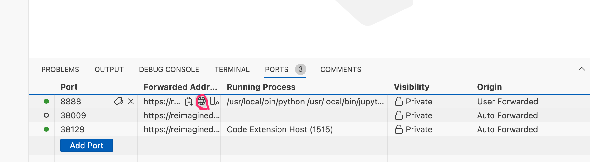
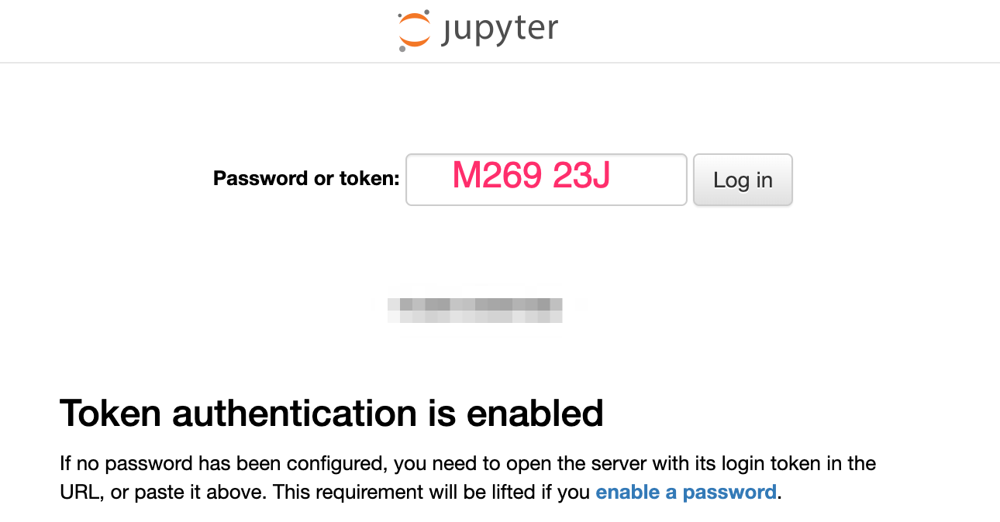

# ou-m269-devcontainer-demo

Unofficial minimal dev container demo for M269.

Access the Python environment provided by the online VCE Dokcer container within a browser based VS Code IDE using GitHub Codespaces and simple `.devcontainer` script.

Wait for the container to be built:

I have my GitHub Codespace environment configured to attempt to launch into JupyterLab and need to manually open the container into a VS Code environment. *Using GitHub default settings, the container would ordinarily open into a VS Code environment automatically.*

Any notebooks uploaded to the environment can be viewed and executed in VS Code. However, it is also possible to run the classic notebook environment from Codespaces too.

## Using the VS Code Environment

The VS Code environment is preinstalled with a Git extension.

If you launch the devcontainer powered Codespace from your own repository you can commit updates back to the repository you started the container from. Updates will also persist inside the container.

## Using the Classic Notebook Environment

To access the classic notebook environment, in the VS Code terminal run the command:

`jupyter nbclassic`

This will start the classic notebook server, although when I ran it, it upset the VS Code browser, which prompted from a reload.

Clicking the reload button and everything seems to be running okay:

We now need to expose the server port. In VS Code, select the *Ports* tab and create a new port, setting it to `8888`:

If you hover the mouse over this port entry you can raise a menu that will open that location in your browser:

Use the password `M269 23J` to access the classic notebook server UI:

You can check the password by running the command `jupyter server list` in a new terminal:

